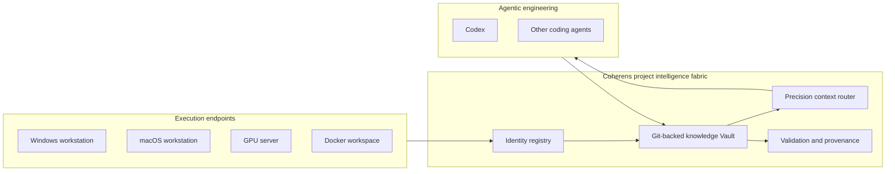

# Coherens

[Chinese README](README.zh-CN.md)

**The project intelligence fabric for multi-endpoint, multi-project agentic engineering.**

> Every project. Every endpoint. One coherent intelligence layer.

Code repositories preserve what changed. Coherens preserves what the
organization learned: why a decision was made, which environment it applies to,
which version proved it, what failed before, and what the next agent needs to
continue with confidence.

Coherens unifies project information from workstations, servers, containers,
branches, versions, and coding agents into a durable, governed knowledge system.
It turns fragmented execution into compounding project intelligence.

## The missing layer in modern engineering

Engineering is no longer confined to one repository on one machine. A single
project may move from Windows development to macOS integration, then to a GPU
container for training and inference. Teams and individuals operate several
projects at once, while Codex and other agents begin every new environment with
different context.

Git moves code, but it does not carry the full operational memory of a project.
Chat histories capture conversations, but they do not establish authoritative,
version-aware knowledge. Traditional documentation stores pages, but it does not
continuously reconcile endpoints, project identities, execution state, and agent
handoffs.

Coherens is that missing coordination layer.

## What Coherens delivers

| Capability | Product outcome |
| --- | --- |
| Multi-endpoint continuity | Continue one project across Windows, macOS, Linux, servers, and Docker without reconstructing its history. |
| Multi-project intelligence | Maintain independent project identities while accumulating reusable knowledge across an entire engineering portfolio. |
| Version-grounded truth | Bind knowledge to repositories, branches, tracks, workspaces, and verified Git commits. |
| Agent-operated lifecycle | Let Codex discover, configure, register, synchronize, validate, and report the workflow from a single user intent. |
| Precision context routing | Load the smallest task-relevant context pack instead of scanning the repository or Vault on every conversation. |
| Governed knowledge accumulation | Separate raw progress, endpoint state, environment differences, version knowledge, runbooks, and durable decisions. |
| Auditable synchronization | Use Markdown and Git for inspectable changes, deterministic validation, provenance, rollback, and collaboration. |

## A shared intelligence fabric, not another notes app

Coherens does not replace Git, your editor, your code repositories, or your
coding agents. It connects them through a stable project identity and a common
knowledge model.



The result is a continuous intelligence loop:

1. Work happens on the endpoint best suited to the task.
2. Agents record compact local progress without loading the cloud Vault.
3. Explicit synchronization converts local progress into versioned evidence.
4. Curated outcomes become reusable project knowledge, decisions, and runbooks.
5. The next endpoint or agent receives only the context needed for its task.

Every completed task makes the project easier to understand, operate, transfer,
and evolve.

## Built for high-friction engineering workflows

- Move development between Windows and macOS without losing decisions or
  rebuilding project understanding.
- Transfer code to Docker or GPU servers with the correct version, environment
  constraints, runbook, and previous failure history.
- Maintain private, experimental, production, and open-source tracks without
  mixing their assumptions.
- Coordinate several active projects and produce project-specific daily
  summaries from synchronized evidence.
- Hand work from one coding agent to another without relying on incompatible
  conversation memory.
- Preserve the reasoning and operational knowledge that source code alone cannot
  express.

## Agent-first by design

Coherens is not a workflow the user must memorize. The user states the outcome;
the agent discovers and operates the process.

For first-time bootstrap, one request is enough:

```text
Configure Coherens from https://github.com/ChengxiSHE/Coherens.git and complete all checks.
```

The dedicated `coherens-setup` Skill pins this canonical repository and directs
Codex to:

1. Inspect Git, Python, Codex plugin support, network access, and GitHub
   authentication.
2. Install and validate the official Coherens plugin.
3. Discover or create a private `Coherens-Vault` repository.
4. Register a stable identity for the current machine or container.
5. Diagnose the environment with `doctor` and resolve discoverable failures.
6. Detect whether the current Git project needs onboarding.
7. Report completed work and request user action only for authentication,
   permissions, or genuinely ambiguous choices.

After installation, users continue to describe real engineering goals:

```text
Continue this project on the GPU server.
Prepare the open-source release from the current private version.
Synchronize today's progress for every active project.
Generate the project knowledge graph.
```

A lightweight `SessionStart` hook checks only local readiness markers. It does
not pull or read the Vault. When setup or project registration is missing, it
gives Codex the routing context needed to handle the next relevant request.

## Knowledge that compounds

Coherens separates information by ownership and durability so the Vault remains
precise as it grows:

| Knowledge layer | Purpose |
| --- | --- |
| `PROGRESS.md` | Lightweight, local, append-only work evidence. |
| `workspaces/` | The current state of each registered machine or container. |
| `environments/` | Operating-system, hardware, container, and runtime differences. |
| `versions/` | Branch, release, experiment, private, and open-source track knowledge. |
| `runbooks/` | Repeatable procedures with prerequisites and verification. |
| `decisions/` | Durable choices, rationale, alternatives, and effective commits. |
| `common/` | Conclusions verified across the relevant endpoints and versions. |
| `context-packs/` | Small task-specific routes to the exact knowledge an agent needs. |

`PROJECT_MAP.md` provides the human-readable portfolio map. `registry.yaml`
provides stable machine routing. Each `projects/<project-id>/index.md` provides
task-level context routing. Git commits anchor claims to concrete code states.

## Trust and control

Coherens is built around explicit boundaries:

- The public product repository and private knowledge Vault are separate Git
  repositories. Branches are never used as a privacy boundary.
- Markdown remains human-readable and Git remains the source of provenance.
- Ordinary coding does not automatically read or synchronize cloud knowledge.
- Passwords, tokens, private keys, raw chat archives, and full terminal dumps do
  not belong in the Vault.
- Synchronization fails closed on dirty or diverged Vault state.
- Pulls are fast-forward-only, generated changes are scoped, and validation runs
  before commit and push.
- Merge conflicts, credential prompts, protected branches, and ambiguous project
  identities are never resolved by guessing.

## Repository model

Coherens uses two repositories:

1. **Public product repository:** plugin, Skills, hooks, deterministic tools,
   schemas, tests, and examples.
   `https://github.com/ChengxiSHE/Coherens.git`
2. **Private intelligence Vault:** real project knowledge, endpoint state,
   version records, decisions, runbooks, and progress evidence.
   Default name: `<github-owner>/Coherens-Vault`

## Local development

Requirements are Python 3.10+, PyYAML 6.x, and Git.

```text
python -m pip install -r requirements.txt
python tools/install_skills.py
```

The repository includes `.codex-plugin/plugin.json` for plugin distribution.
Restart Codex if locally installed Skills do not appear immediately. Plugin
lifecycle hooks require a one-time Codex trust review before they can run.

## Verification

```text
python skills/project-knowledge/scripts/project_knowledge.py validate --knowledge-root .
python skills/knowledge-graph-view/scripts/knowledge_graph.py --knowledge-root .
python -m unittest discover -s tests -v
```

Coherens gives every project a durable memory, every endpoint a shared operating
picture, and every agent the context to move work forward without starting over.
